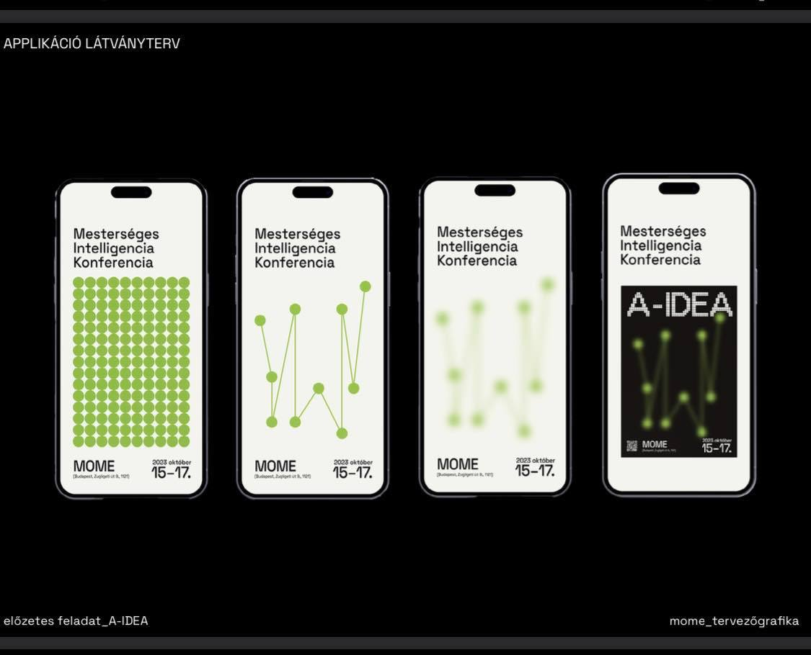

# 🖥️ A-IDEA Applikáció  

Ez az applikáció egy **grafikus látványterv digitális megvalósítása**, amelyet egy **Mesterséges Intelligencia Konferenciához** terveztek. Az alkalmazás **interaktív pontokat és vonalakat** használ, amelyek **elhomályosodnak**, majd a konferencia logójává alakulnak.  

---

## 📂 Fájlstruktúra  

📄 **`index.html`** – Az applikáció HTML váza  
🎨 **`style.css`** – Az applikáció stílusa  
📝 **`script.js`** – Az interaktivitásért felelős JavaScript kód  

---

## ✨ Funkciók  

✔ **Pontokból álló 10x14-es mátrix generálása**  
✔ **Interaktív vonalhúzás a pontok között**  
✔ **Érintésérzékeny interakció támogatása** (mobil kompatibilitás)  
✔ **Automatikus homályosítás és logómegjelenítés**  
✔ **Képmentési lehetőség az elkészült látványtervről**  

---

## 🚀 Használat  

1️⃣ **Nyisd meg** az `index.html` fájlt egy böngészőben  
2️⃣ **Érintéssel vagy kattintással** húzd a vonalakat a pontok között  
3️⃣ Ha a jobb oldali oszlopig elérsz, az alkalmazás **automatikusan elhomályosítja a képet és megjeleníti a logót**  
4️⃣ Az elkészült látványterv **letölthető képként**  

---

## 🛠️ Használt technológiák  

- 🎨 **HTML5 Canvas** – A pontok és vonalak megjelenítésére  
- ⚡ **JavaScript** – Az interaktivitás biztosítására  
- 🎭 **CSS** – Az esztétikus megjelenéshez  
- 📸 **html2canvas** – A képmentési funkcióhoz  

---

## Készítette

👨‍💻 **Ádám Risztics**

---
